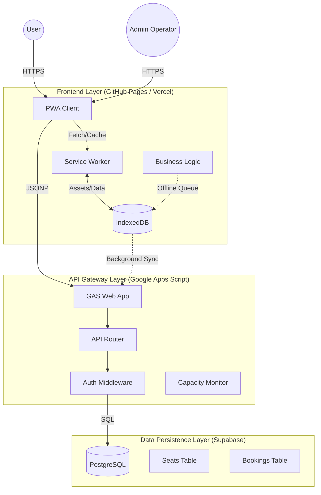
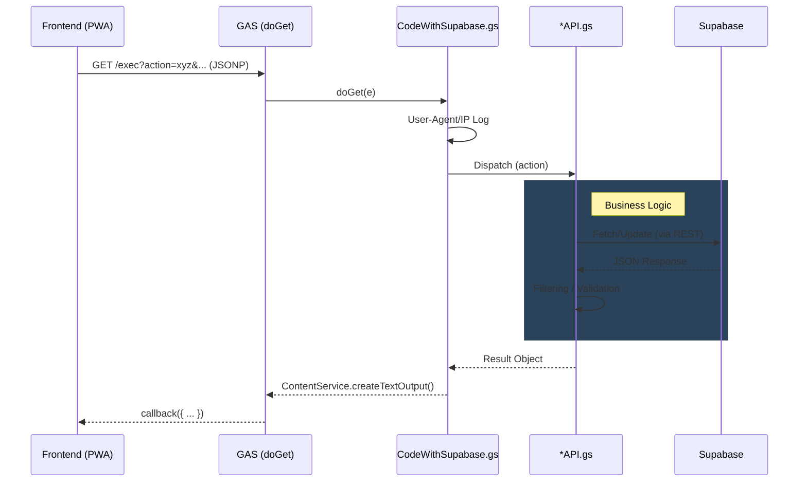
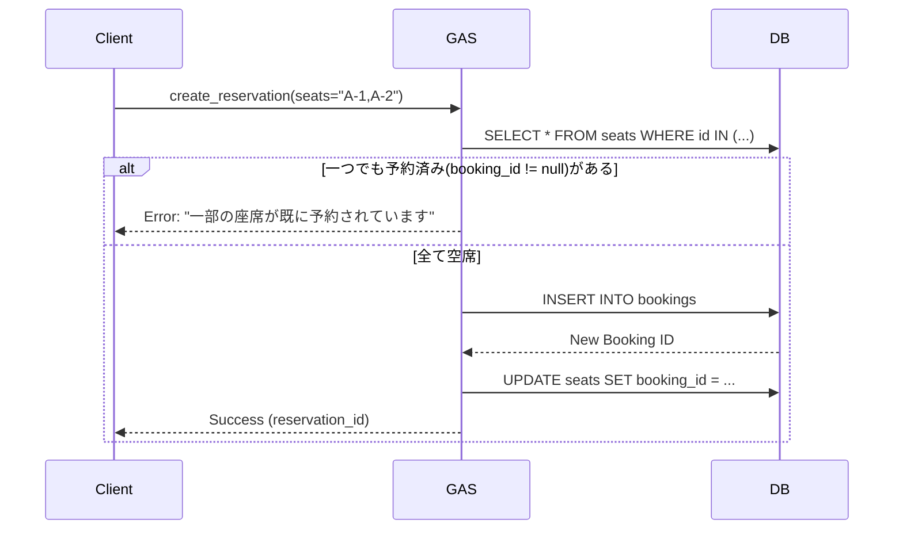

# 市川学園 座席管理システム v1.0.0 技術仕様書

## 1. システム概要

本システムは、大規模イベントにおける座席予約、発券、入場管理、およびリアルタイム監視を行うための統合プラットフォームである。
「**ネットワーク遮断状況下における業務継続性 (Business Continuity in Offline Environments)**」を最優先設計事項とし、PWA (Progressive Web App) 技術と高度な同期ロジックを組み合わせることで、不安定な通信環境下でもすべての主要機能（予約・発券・チェックイン）の利用を可能にしている。

---

## 2. アーキテクチャ

システムは、静的配信される **Frontend (SPA/PWA)**、サーバーレスAPIゲートウェイとしての **Google Apps Script (GAS)**、そしてリレーショナルデータベースとしての **Supabase (PostgreSQL)** からなる3層ハイブリッド・アーキテクチャを採用している。

### 2.1 構成図



### 2.2 設計思想

1.  **オフラインファースト**: すべてのUI操作（座席選択、予約確定、チェックイン）は、まずローカルの状態（State）を更新し、非同期でサーバーとの同期を試みる「Optimistic AI」パターンを採用。
2.  **分散型負荷対策**: GASのクォータ制限（同時接続数など）を回避するため、クライアント側で複数のGASデプロイメントIDを管理し、自動的に負荷分散（ロードバランシング）とフェイルオーバーを行う `APIUrlManager` を実装。
3.  **データ整合性**: Supabase上のPostgreSQLによるACIDトランザクションを利用し、特に「座席変更（Rebooking）」や「同時予約」におけるRace Condition（競合）を防止。

---

## 3. ディレクトリ・ファイル構成詳解

各モジュールの責務と詳細を以下に示す。

### 3.1 `assets/js/` (Frontend Logic)

フロントエンドはVanilla JS (ES Modules) で構築されており、ビルドプロセスを必要としない。

#### コア・インフラストラクチャ
*   **`config.js`**: アプリケーション全体の設定ファイル。APIエンドポイント（`GAS_API_URLS`）、Supabaseキー、閾値設定などを集約。
*   **`optimized-loader.js`**: 依存関係解決機能付きのモジュールローダー。`Ordered Map` を使用し、実行順序を保証しつつ並列ダウンロードを行う。
*   **`auth.js`**: 認証モジュール。`sessionStorage` を利用した管理者セッション管理、パスワードハッシュ（簡易）、権限レベル（L0-L3）の判定。
*   **`error-handler.js`**: グローバルエラーハンドリング。未捕捉の例外（Uncaught Exception）やPromise棄却（Unhandled Rejection）を捕捉し、ユーザーフレンドリーな通知を表示。

#### 通信・データ管理
*   **`api.js`**: 基本的なGAS APIクライアント。JSONP方式によるクロスドメイン通信の実装。
*   **`optimized-api.js`**: `api.js` の拡張版。同一リクエストの重複排除（Debounce/Dedup）と、レスポンスキャッシュ機能を提供。
*   **`api-cache.js`**: APIレスポンス専用のキャッシュマネージャ。`localStorage` とメモリキャッシュの2階層構造。TTL（有効期限）管理を行う。
*   **`offline-sync-v2.js`**: **【重要】** オフライン同期エンジン v2。操作ログを `IndexedDB` にキューイングし、ネットワーク復帰時にFIFO（先入れ先出し）で同期を実行。再試行回数とエラーバックオフ制御を含む。
*   **`supabase-client.js`**: `supabase-js` SDKの薄いラッパー。主に管理者機能での直接DB参照に使用。

#### 予約・座席ロジック
*   **`seats-main.js`**: 座席予約システムのコア。Canvas/DOMを用いた座席マップのレンダリング、`AdminAPI` と連携した状態管理、座席クリックイベントのルーター。
*   **`reservation.js`**: 予約フォームのバリデーションと送信処理。
*   **`reservation-status.js`**: 既存予約の照会・キャンセルロジック。
*   **`seat-config.js`**: 座席レイアウト定義（行数、列数、通路位置）。静的定数として管理。

#### 管理者・特殊機能
*   **`admin.js`**: 管理者ダッシュボードのメインロジック。検索、一覧表示、チェックイン、モーダル制御。
*   **`admin-scan.js`**: `html5-qrcode` ライブラリを用いたQRコードスキャンとチェックイン処理。
*   **`walkin-main.js`**: 当日券発行ロジック。座席自動割当アルゴリズム（連続席優先・前方優先）を実装。
*   **`logs-main.js`**: サーバーサイド監査ログの取得と表示。
*   **`enhanced-status-monitor.js`**: 監視エージェント。15秒間隔で全公演の残席数をポーリングし、変化を検知して通知APIをトリガーする。

#### PWA・ライフサイクル
*   **`pwa-install.js`**: A2HS (Add to Home Screen) プロンプトの制御。OS判定によるインストールガイド表示。
*   **`pwa-update.js`**: Service Workerの更新検知。更新待機状態（`waiting`）のSWがある場合、ユーザーに更新トーストを表示し、`skipWaiting` を送信してリロードを促す。

---

### 3.2 `gas/` (Backend Logic)

Google Apps Scriptは、V8ランタイム上で動作するTypeScriptライクなJavaScriptで記述されている。

#### エントリーポイント
*   **`CodeWithSupabase.gs`**: メインエントリポイント。`doGet(e)` および `doPost(e)` 関数が定義されており、リクエストパラメータ `action` に基づいて適切なAPI関数へルーティングする。

#### API モジュール
*   **`AdminAPI.gs`**: 管理者用API群。予約検索、座席一括変更（Rebook）、強制チェックイン、メール再送など、特権操作を定義。
*   **`ReservationAPI.gs`**: 一般予約用API群。新規予約作成（`createReservation`）、キャンセル（`cancelReservation`）、チェックイン（`checkInReservation`）。排他制御（ロック）を含む。
*   **`SupabaseIntegration.gs`**: Supabase連携クラス。`UrlFetchApp` を使用して Supabase REST API をコールする。Service Role Key を使用した特権アクセスもここで行う。
*   **`SupabaseSettings.gs`**: Supabase接続情報（URL, Key）の管理。スクリプトプロパティから読み込む。

---

## 4. API 仕様 (Action Reference)

クライアントは `GAS_API_URLS` に対して `GET` リクエスト（JSONP）を送信する。
共通パラメータ: `action`（必須）, `callback`（必須）。

### 4.1 一般公開 API (Public)

| Action | パラメータ | 説明 |
| :--- | :--- | :--- |
| `get_seats` | `group`, `day`, `timeslot` | 指定された公演の全座席状態（`status`）と予約ID（ハッシュ化済）を取得。 |
| `create_reservation` | `name`, `email`, `seats`(CSV), `passcode` | 新規予約を作成。座席の競合チェックを行い、成功すれば `reservation_id` を返す。 |
| `check_in` | `id` (Booking ID), `passcode` | ユーザーパスコードによるチェックイン。 |
| `cancel_reservation` | `id`, `passcode` | 予約のキャンセルと座席の即時開放。 |

### 4.2 管理者専用 API (Admin - L1+)

| Action | パラメータ | 説明 |
| :--- | :--- | :--- |
| `admin_get_reservations` | `search`, `group`, `day`, `timeslot` | 予約データの検索。`search` パラメータは、ID（数値）、予約ID（UUID）、名前、メール、**座席番号** に対して部分一致検索を行う。 |
| `admin_change_seats` | `id`, `seats` (New Seat IDs) | **座席変更（Rebook）**。指定した予約IDに紐づく現在の座席を全て「空席」に戻し、新しい座席を「予約済」として紐付けるトランザクション的処理。 |
| `admin_update_reservation` | `id`, `updates` (JSON) | 予約情報（名前、メール、備考など）の更新。 |
| `admin_resend_email` | `id` | 予約完了メールの再送処理。 |

### 4.3 API 内部ロジックとフロー (Architecture Deep Dive)

本システムのAPIは、単なるCRUDラッパーではなく、いくつかの複雑なオーケストレーションを担当している。

#### 1. リクエストフロー (Request Lifecycle)



#### 2. 重要アクションのシーケンス詳細

**A. 新規予約 (`create_reservation`)**
座席の二重予約（Double Booking）を防止するため、厳密なチェックとロック機構を持つ。



**B. チェックイン (`check_in`)**
QRスキャンまたは手動入力により実行される。

1.  **Lookup**: `bookings` テーブルを `id` (Short ID) で検索。
2.  **Verify**: 入力された `passcode` と DB上のパスコードを照合。
3.  **Update**:
    *   `bookings` テーブルの `status` を `'checked_in'` に更新。
    *   紐づく `seats` レコードの `status` も `'checked_in'` に更新（冗長化による参照高速化）。
4.  **Audit**: 監査ログに「チェックイン成功」を記録。

**C. 管理者検索 (`admin_get_reservations`)**
前述の通り、GAS側でのインメモリフィルタリングを行うが、パフォーマンス最適化のために以下の工夫がなされている。

1.  **Prefetch**: 検索ワードが空の場合、直近の予約50件のみを取得。
2.  **Smart Filter**:
    *   数字のみの検索 (`123`): ID検索とみなし、数値型変換して比較。
    *   UUID形式 (`...-....`): Reservation ID検索とみなす。
    *   座席形式 (`A-1`): 座席ID検索とみなす。
3.  **Cross-Join**: 予約者が特定できたら、その予約IDを持つ座席レコードを別クエリで一括取得 (`WHERE booking_id IN (...)`) し、結果に統合する。

---

## 5. データベース設計 (Supabase Schema)

データストアには PostgreSQL を使用し、正規化されたリレーショナルモデルを採用している。

### 5.1 テーブル定義

#### `performances` (公演マスタ)
公演を定義する。
*   `id` (Int, PK): 内部ID
*   `group_name` (Text): 団体名（例: "Orchestra"）
*   `day` (Int): 日程（1 or 2）
*   `timeslot` (Text): 時間帯ID（例: "A"）

#### `bookings` (予約情報)
予約者情報を管理する。
*   `id` (Int, PK): 内部ID（検索に使用）
*   `reservation_id` (UUID): 外部公開用ID
*   `name` (Text): 予約者名
*   `email` (Text): アドレス
*   `passcode` (Text): キャンセル/チェックイン用パスコード
*   `status` (Text): `'confirmed'`, `'checked_in'`, `'cancelled'`
*   `created_at` (Timestamptz)

#### `seats` (座席情報)
**システムの中心となるテーブル**。すべての座席の状態を管理する。
*   `seat_id` (Text, PK): 座席番号（例: "A-1"） + `performance_id` の複合主キー的役割（実際にはサロゲートキーまたは複合ユニーク制約）。
*   `performance_id` (Int, FK): 公演ID
*   `booking_id` (Int, FK, Nullable): **予約IDへの参照。これが NULL なら「空席」、値があれば「予約済」と判定される。**
*   `status` (Text): `'available'`, `'reserved'`, `'secured'` (確保), `'checked_in'`。
    *   ※ `booking_id` がある場合、`status` は補完的な情報となるが、検索速度向上のために維持される。

### 5.2 インデックス戦略
*   `seats(performance_id)`: 座席マップ取得の高速化。
*   `seats(booking_id)`: 予約IDからの座席逆引き（キャンセル/変更時）の高速化。
*   `bookings(reservation_id)`: UUID検索の高速化。
*   `bookings(email)`: 管理者検索の高速化。

---

## 6. 重要ロジック詳解

### 6.1 管理者検索ロジック (In-Memory Filtering)
Supabase (PostgreSQL) は、UUID型カラムに対して数値や不適切な文字列での検索を行うとエラー（Type Error）を返す厳格な仕様がある。
これを回避し、かつ「座席番号（DB上は別テーブル）」も含めた横断検索を実現するため、以下の戦略を採用している。

1.  **Scope Fetch**: GASはまず、指定された公演（Group/Day/Timeslot）に該当する予約データをDBからフェッチする（必要最小限のフィルタリング）。
2.  **Join Strategy**: 予約データ (`bookings`) と 座席データ (`seats`) をアプリケーションレベル（JS）で結合する。
3.  **In-Memory Search**: 結合されたデータ配列に対して、検索キーワードを用いたフィルタリングを行う。
    *   キーワードが数値のみ → `id` と比較。
    *   キーワードが "A-1" のような形式 → `seats.seat_id` と比較。
    *   それ以外 → `name`, `email`, `reservation_id` (String cast) と比較。
これにより、柔軟かつエラーのない検索体験を実現している。

### 6.2 リブッキング（座席変更）ロジック
「座席変更」は単純な UPDATE ではなく、以下の手順で行われる。
1.  **Validation**: 新しい座席が本当に「空席」であることを確認。
2.  **Release**: 対象予約ID (`booking_id`) に紐づく現在の座席すべての `booking_id` を `NULL` に、ステータスを `'available'` に更新（開放）。
3.  **Reserve**: 新しい座席リストの `booking_id` を対象予約IDに設定し、ステータスを `'reserved'` に更新。
これを（擬似的な）アトミック操作として実行することで、座席の二重割り当てや「幽霊予約（データだけ残る現象）」を防ぐ。

### 6.3 PWA アップデートフロー
ユーザーに常に最新のアプリケーションを提供するため、以下のフローを実装している。
1.  **Service Worker Registration**: `sw.js` が登録される。
2.  **Update Detection**: ブラウザが `sw.js` のバイト単位の変更を検知すると、新しい SW をインストールし、`waiting` 状態にする。
3.  **UI Notification**: `pwa-update.js` が `updatefound` イベントおよび `statechange` を監視。新しい SW が `waiting` になった時点で、画面下部に更新トーストを表示する。
4.  **Activation**: ユーザーが「更新」ボタンを押すと、`message` 経由で `SKIP_WAITING` シグナルを SW に送信。SW は直ちに `activate` され、ページはリロードされて最新版となる。

---

## 7. セットアップ手順

開発環境および本番環境の構築手順。

### 7.1 前提条件
*   Node.js (開発用ツール使用の場合)
*   Google Account (GASデプロイ用)
*   Supabase Account

### 7.2 バックエンド (GAS & Supabase) 構築
1.  **Database**:
    *   Supabase プロジェクトを作成。
    *   `database/supabase-schema.sql` を SQL Editor で実行。
2.  **GAS**:
    *   Google Drive で新規 GAS プロジェクト作成。
    *   `gas/` ディレクトリ内の全ファイルをコピー＆ペースト。
    *   **スクリプトプロパティ** を設定:
        *   `SUPABASE_URL`: (Supabase URL)
        *   `SUPABASE_ANON_KEY`: (Anon Key)
        *   `SUPABASE_SERVICE_ROLE_KEY`: (Service Role Key - Admin機能に必須)
        *   `ADMIN_PASSWORD`: (管理者ログイントークン)
        *   `SUPERADMIN_PASSWORD`: (特権管理者トークン)
    *   ウェブアプリとしてデプロイ（アクセス権: 全員）。デプロイURLを控える。

### 7.3 フロントエンド設定
1.  `assets/js/config.js` を開く。
2.  `GAS_API_URLS` 配列に、取得した GAS のウェブアプリ URL を文字列として設定する。
    ```javascript
    const GAS_API_URLS = [
      "https://script.google.com/macros/s/AKfycbx.../exec"
    ];
    ```
    (※ 負荷分散のため、同一スクリプトの別デプロイIDを複数設定することも可能)

### 7.4 デプロイ
GitHub Pages, Vercel, Firebase Hosting などの静的ホスティングサービスに、プロジェクトルート以下のファイルをアップロードする。
特殊なビルドコマンドは不要。

---

**市川学園 座席管理システム v1.0.0**
Technical Documentation
Commit: `v1.0.0`
