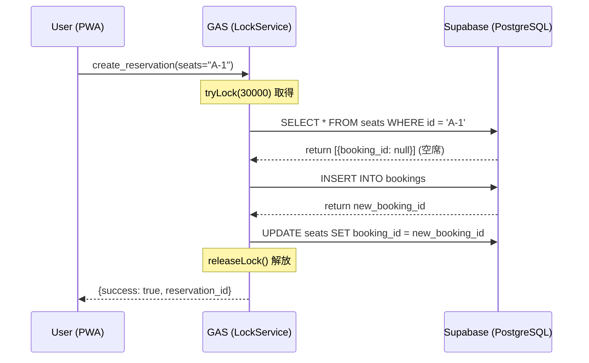
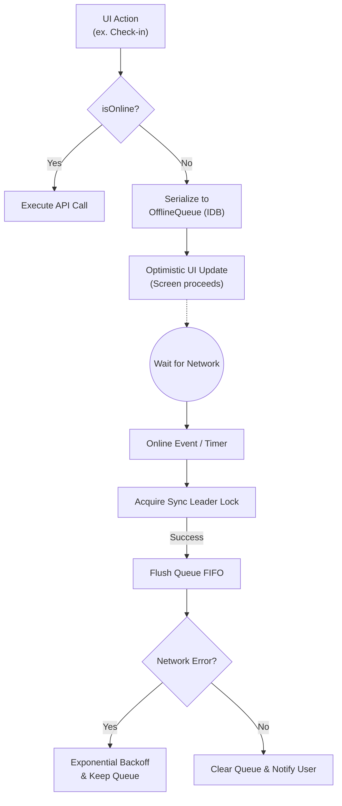
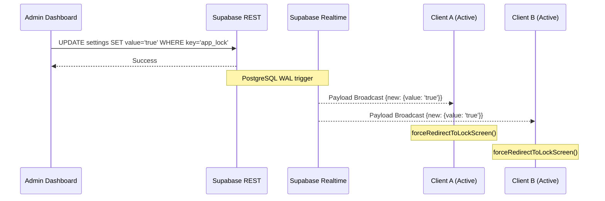
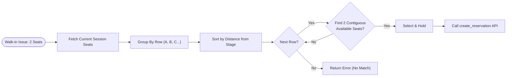
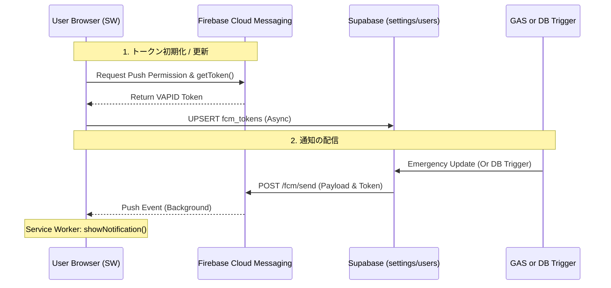

# 市川学園 座席管理システム（Nチケ） v32.0.5 技術仕様書

本ドキュメントは、システムアーキテクトおよびバックエンド/フロントエンド・エンジニア向けの**全機能コードレベル解説書**である。
ネットワーク遮断時の業務継続性（オフライン・ファースト）、強力な排他制御（Mutex Layer）、WebSocketを利用したリアルタイム同期、およびDOMPurifyとRLSを用いた多層防御（Defense in Depth）の実装詳細について、ソースコードの挙動を基に網羅的に解説する。

---

## 1. システム・アーキテクチャ概要 (System Architecture)

本システムは、高いスケーラビリティと可用性を求められるミッション・クリティカルなイベント管理システムとして、以下の4層ハイブリッド・アーキテクチャを採用している。

1.  **Frontend (PWA / SPA)**: Vanilla JS (ES Modules) にて構成。Service Workerによる静的アセットのキャッシュと、IndexedDBによる操作キューイングを持つオフラインファーストUI。
2.  **API Gateway (GAS)**: Google Apps Scriptをエッジルーターおよびトランザクションの排他制御レイヤー（LockService）として利用。
3.  **Data Persistence (Supabase PostgreSQL)**: ACID特性を持つ永続化層。Row Level Security (RLS) によるアクセス制御と、PostgRESTによるAPIインターフェースを提供。
4.  **Realtime & Notification (Supabase Realtime / Firebase FCM)**: WebSocketによるフロントエンドへの状態ブロードキャストと、FCMによるバックグラウンド・プッシュ通知インフラ。


```mermaid
%%{init: {
  'theme': 'dark', 
  'themeVariables': { 
    'lineColor': '#ffffff',
    'fontSize': '14px',
    'fontFamily': 'monospace'
  }
}}%%
flowchart TB
    %% =======================
    %% Users Layer
    %% =======================
    subgraph Users ["Actors"]
        direction LR
        U1(["一般ユーザー"])
        U2(["特権管理者 (L1-L3)"])
    end

    %% =======================
    %% Frontend Layer (PWA)
    %% =======================
    subgraph Frontend ["Frontend Layer (PWA / SPA)"]
        direction TB
        
        subgraph Logic ["Core Business Logic & Security"]
            CFG([config.js])
            AUTH([auth.js / DOMPurify])
            Router([Router / Page Scripts])
        end
        
        subgraph Offline ["Offline & Sync Engine"]
            IDB[("IndexedDB Queue\n(offline-sync-v2.js)")]
            SW{{"Service Worker (sw.js)"}}
        end
        
        subgraph API_Client ["API & Network Clients"]
            OptimizedAPI(["optimized-api.js\n(Debounce & Dedup)"])
            Cache(["api-cache.js\n(LocalStorage & Memory)"])
            SupaClient([supabase-client.js])
        end
        
        subgraph Realtime_Client ["Realtime & UI"]
            SysLock([system-lock.js])
            UI[Dynamic DOM/CSS Rendering]
            Monitor([enhanced-status-monitor.js])
        end
        
        %% Internal Frontend Flow
        Router --> OptimizedAPI
        OptimizedAPI <--> Cache
        OptimizedAPI --> IDB
        SW <--> IDB
        Router --> UI
        SysLock --> UI
    end

    %% =======================
    %% API Gateway Layer (GAS)
    %% =======================
    subgraph GAS ["API Gateway Layer (Google Apps Script)"]
        direction TB
        RouterGAS[["CodeWithSupabase.gs\n(doGet Router)"]]
        
        subgraph Logic_GAS ["Business Services"]
            ResAPI[(ReservationAPI.gs)]
            AdminAPI[(AdminAPI.gs)]
            MasterData[(MasterDataAPI.gs)]
            Mutex{"LockService\n(MAX 30s)"}
        end
        
        subgraph DB_Bridge ["Supabase Integration"]
            SupaInt(["SupabaseIntegration.gs\n(UrlFetchApp)"])
            ServiceRole[("Service Role Key")]
        end
        
        %% Internal GAS Flow
        RouterGAS --> ResAPI
        RouterGAS --> AdminAPI
        RouterGAS --> MasterData
        
        ResAPI --> Mutex
        Mutex --> SupaInt
        AdminAPI --> SupaInt
        MasterData --> SupaInt
        ServiceRole -.-> SupaInt
    end

    %% =======================
    %% Database Layer
    %% =======================
    subgraph Supabase ["Data Persistence (Supabase / PostgreSQL)"]
        direction TB
        PostgREST{{PostgREST API}}
        RLS["Row Level Security (RLS)"]
        
        subgraph Databases ["Tables & Views"]
            T_Seats[(seats)]
            T_Bookings[(bookings)]
            T_Perform[(performances)]
            T_Logs[(audit_logs)]
            T_Settings[(settings)]
            V_AdminView[(admin_reservations_view)]
        end
        
        RealtimeServer(("Realtime Pub/Sub Server"))
        
        %% Internal DB Flow
        PostgREST --> RLS
        RLS --> Databases
        T_Settings -.-> RealtimeServer
        T_Seats -.-> RealtimeServer
    end

    %% =======================
    %% Notification Layer
    %% =======================
    subgraph Firebase ["Notification Infrastructure"]
        direction TB
        FCM(("Firebase Cloud Messaging"))
    end

    %% =======================
    %% Cross-Layer Connections
    %% =======================
    U1 -->|HTTPS| Frontend
    U2 -->|HTTPS| Frontend
    
    %% Frontend to GAS
    OptimizedAPI -->|"HTTPS GET Request\n(JSONP Payload)"| RouterGAS
    IDB -.->|Background Sync| RouterGAS
    
    %% Frontend to Supabase (Direct)
    SupaClient -->|"HTTPS REST\n(Anon Key)"| PostgREST
    SysLock <==>|WebSocket WSS| RealtimeServer
    Monitor <==>|WebSocket WSS| RealtimeServer
    
    %% GAS to Supabase
    SupaInt -->|"HTTPS POST/PATCH\n(Service Role)"| PostgREST
    
    %% Datatabase to FCM
    T_Bookings -.->|Webhook Trigger| FCM
    T_Seats -.->|Webhook Trigger| FCM
    
    %% FCM to Frontend
    FCM -.->|Push Payload| SW

    classDef FrontendClass fill:#0d1117,stroke:#58a6ff,stroke-width:2px;
    classDef GASClass fill:#04260f,stroke:#3fb950,stroke-width:2px;
    classDef DBClass fill:#181029,stroke:#a371f7,stroke-width:2px;
    classDef FireClass fill:#2d1a04,stroke:#ffb84d,stroke-width:2px;

    class Frontend FrontendClass
    class GAS GASClass
    class Supabase DBClass
    class Firebase FireClass
```

---

## 2. ディレクトリ構成とモジュール設計

システムはビルド・パイプラインを持たないネイティブなES Modules環境で稼働している。以下は `assets/js/` および `gas/` の主要ソースコードの責務。

### 2.1 フロントエンド・コアモジュール (`assets/js/`)

*   **`config.js`**: アプリケーション設定のセントラル・レジストリ。`GAS_API_URLS`配列（複数エンドポイントによるロードバランシング）や、Supabase URL/Key、FCM公開鍵（VAPID）を環境変数的に定義。
*   **`optimized-loader.js`**: スクリプトの依存関係ツリーを解決しながら並行ダウンロードし、順序を保証して実行するカスタム・モジュールローダー。
*   **`api.js` / `optimized-api.js`**: JSONPを用いたクロスドメインリクエスト基盤。`optimized-api.js`は、短期間の重複リクエスト（例：連打）をDebounce/Deduplicationし、ネットワーク帯域を最適化する。
*   **`api-cache.js`**: 読み取り系API（`get_seats`等）のレスポンスを`localStorage`とメモリの2階層でキャッシュ・TTL管理。
*   **`offline-sync-v2.js`**: システムの核心である**オフライン同期エンジン**。（詳細は第3章で解説）。
*   **`supabase-client.js`**: `@supabase/supabase-js` を用いた直接クライアント。管理機能（L1-L3権限）において、大量のデータ取得（View経由）やRealtime購読に用いる。
*   **【Security】`auth.js`**: セッション・ストレージ・ベースの権限管理モジュール。
*   **【Security】DOMPurify連携**: クライアントサイドでのJSX/innerHTML代入前に行う、完全なDOMサニタイズ。

### 2.2 バックエンド・ルーター (`gas/`)

*   **`CodeWithSupabase.gs`**: メインルーター（`doGet`, `doPost`を受け付けるエントリポイント）。クエリパラメータの`action`に応じたディスパッチを行う。
*   **`ReservationAPI.gs` / `AdminAPI.gs`**: ビジネスロジック。
*   **`SupabaseIntegration.gs`**: GASの`UrlFetchApp`ラップクラス。Service Role Keyを用いて、PostgREST（`/rest/v1/`）エンドポイントへのHTTPS要求を構築・発行。

---

## 3. 重要機能のコードレベル解説

### 3.1 【排他制御】予約確定のトランザクション (Mutex/Double Booking Guard)
高負荷な座席予約において、競合条件（Race Condition）を防ぐため、GAS側の `LockService` と Supabase側のステータス検証によるハイブリッド制御を行っている。

**実装箇所:** `ReservationAPI.gs` -> `createReservation`

```javascript
// GAS側 (ReservationAPI.gs の擬似コード)
function createReservation(seats, details) {
  // 1. スクリプト全体の排他ロックを取得 (最大待機30秒)
  var lock = LockService.getScriptLock();
  if (!lock.tryLock(30000)) throw new Error("Server Busy");
  
  try {
    // 2. 空席チェッククエリ (DB参照)
    var currentSeats = Supabase.query("seats", { id: { "in": seats }});
    var isOccupied = currentSeats.some(s => s.booking_id !== null);
    
    if (isOccupied) {
      throw new Error("一部の座席が既に予約されています");
    }
    
    // 3. 予約トランザクション
    var newBookingId = Supabase.insert("bookings", details); // 予約作成
    Supabase.update("seats", { booking_id: newBookingId }, { id: { "in": seats }}); // 座席リンク
    
    return { success: true, reservation_id: newBookingId };
    
  } finally {
    // 4. ロック解放
    lock.releaseLock();
  }
}
```

**【シーケンス検証】予約フローのデータ連携図:**


```mermaid
sequenceDiagram
    participant User as User (PWA)
    participant GAS as GAS (LockService)
    participant DB as Supabase (PostgreSQL)

    User->>GAS: create_reservation(seats="A-1")
    note over GAS: tryLock(30000) 取得
    GAS->>DB: SELECT * FROM seats WHERE id = 'A-1'
    DB-->>GAS: return [{booking_id: null}] (空席)
    
    GAS->>DB: INSERT INTO bookings
    DB-->>GAS: return new_booking_id
    
    GAS->>DB: UPDATE seats SET booking_id = new_booking_id
    note over GAS: releaseLock() 解放
    GAS-->>User: {success: true, reservation_id}
```

**解説:**
本システムでは、座席（`seats`）テーブルの`booking_id`カラムが `NULL` であることのみを「空席」の真実のソース（Source of Truth）としている。`LockService`により、GASの実行インスタンスを跨いだ完全な直列化（Serialization）が保証される。

### 3.2 【可用性】オフライン同期エンジン v2 (Optimistic AI)
ネットワークが遮断された環境下でも、ユーザー体験を損なわずに業務を継続する仕組み。

**実装箇所:** `assets/js/offline-sync-v2.js`

1.  **Operation Serialization**: リクエスト発生時、`navigator.onLine`がFalse、またはFetchエラーした場合、リクエストの全ペイロードを `IndexedDB` の `OfflineQueue` にオブジェクトとして格納する。
2.  **State Mutation (Optimistic Update)**: 通信を待たず、メモリ上のキャッシュデータを書き換え、UI（座席が青から赤に変わるなど）を直ちに進行させる。
3.  **Background Sync**:
    *   複数のタブが開かれている場合の多重リクエストを防ぐため、`Web Locks API` または `BroadcastChannel` を用いて、1つのブラウザタブのみがSync Coordinatorとして振る舞うLeader-Election（リーダー選出）アルゴリズムを実装している。

**【プロセス検証】オフライン操作から同期完了までのフロー:**


```mermaid
flowchart TD
    Action["UI Action\n(ex. Check-in)"] --> Check{"isOnline?"}
    Check -- Yes --> API[Execute API Call]
    
    Check -- No --> Q["Serialize to\nOfflineQueue (IDB)"]
    Q --> UI["Optimistic UI Update\n(Screen proceeds)"]
    
    UI -.-> wait((Wait for Network))
    wait --> Event[Online Event / Timer]
    Event --> Lock[Acquire Sync Leader Lock]
    Lock -- Success --> Flush[Flush Queue FIFO]
    Flush --> Retry{"Network Error?"}
    Retry -- Yes --> Backoff[Exponential Backoff\n& Keep Queue]
    Retry -- No --> Clear[Clear Queue & Notify User]
```

### 3.3 【リアルタイム】System App Lock の同期機構
管理者が「すべての予約操作を一時停止」させた瞬間、全ユーザー（クライアント）の画面を即座にブロックする。

**実装箇所:** `assets/js/system-lock.js`

```javascript
// クライアント側 (system-lock.js)
const channel = supabase
  .channel('public:settings')
  .on('postgres_changes', { 
    event: 'UPDATE', 
    schema: 'public', 
    table: 'settings',
    filter: 'key=eq.app_lock' 
  }, (payload) => {
    // 新しい値を受信
    const isLocked = payload.new.value === 'true';
    if (isLocked) {
      forceRedirectToLockScreen(); // 強制リダイレクト＆操作無効化
    } else {
      removeLockOverlay(); // ロック解除
    }
  })
  .subscribe();
```

**【アーキテクチャ検証】App Lockの伝播フロー:**


```mermaid
sequenceDiagram
    participant Admin as Admin Dashboard
    participant API as Supabase REST
    participant RT as Supabase Realtime
    participant C1 as Client A (Active)
    participant C2 as Client B (Active)

    Admin->>API: UPDATE settings SET value='true' WHERE key='app_lock'
    API-->>Admin: Success
    note over API,RT: PostgreSQL WAL trigger
    RT-->>C1: Payload Broadcast {new: {value: 'true'}}
    RT-->>C2: Payload Broadcast {new: {value: 'true'}}
    
    note over C1: forceRedirectToLockScreen()
    note over C2: forceRedirectToLockScreen()
```

**解説:**
Supabase Realtime（PostgresWAL監視によるWebSockets）を使用。ポーリング（定期問い合わせ）を行わないためサーバー負荷がなく、遅延50ms以下で全クライアントを一斉操作する。管理画面（`admin.js`）からの UPDATE をトリガーとする。

### 3.4 【UI/UX】DOMレンダリング最適化 (Canvas非依存の座席マップ)
WebGLやHTML5 Canvasを用いず、DOMのみを用いることでアクセシビリティ（スクリーンリーダー等）とPWAとしての軽量さを両立した座席マップの実装。

**実装箇所:** `assets/js/seats-main.js`

*   **Dynamic Grid Layout**: CSS Gridを活用し、行（Row）と列（Column）のコンテナをJSで動的に生成。
*   **CSS Transform Zooming**: 座席マップの拡大縮小を `width`/`height` の再計算ではなく、CSSカスケード変数の操作 (`--seat-scale: 1.5`など) または `transform: scale()` によって処理し、ブラウザのComposite（合成）レイヤーだけで描画を完結（GPUアクセラレーション）させることで、数千規模の座席DOMでも60fpsのパン/ズームを維持する。

### 3.5 【アルゴリズム】Walk-in 当日券 最適座席アロケーション
管理画面の当日券（`walkin.html`）において、「X枚の連続する空席」を最速で探索する最適化アルゴリズム。

**実装箇所:** `assets/js/walkin-main.js`

```javascript
// 当日券座席検索アルゴリズム (擬似コード)
function findContiguousSeats(seatMap, desiredCount) {
  const rows = groupSeatsByRowAndSort(seatMap); // 優先度の高い行（前方中央）から整列
  
  for (const row of rows) {
    let contiguous = [];
    for (const seat of row.seats) {
      if (seat.status === 'available') {
        contiguous.push(seat);
        if (contiguous.length === desiredCount) {
           return contiguous; // 条件を満たせば即Return (Early Exit)
        }
      } else {
        contiguous = []; // 空席が途切れたらリセット
      }
    }
  }
  return null; // 見つからない場合
}
```

**【探索ロジック検証】当日券の座席抽出フロー:**


```mermaid
flowchart LR
    Start([Walk-in Issue: 2 Seats]) --> Fetch[Fetch Current Session Seats]
    Fetch --> Group["Group By Row (A, B, C...)"]
    Group --> Sort[Sort by Distance from Stage]
    Sort --> IterR{"Next Row?"}
    
    IterR -- Yes --> IterS{"Find 2 Contiguous\nAvailable Seats?"}
    IterS -- No --> IterR
    IterS -- Yes --> Select[Select & Hold]
    
    Select --> Commit[Call create_reservation API]
    IterR -- No --> Fail["Return Error (No Match)"]
```

### 3.6 【セキュリティ防御】DOMPurifyとXSS対策
本システムは管理者機能を持つため、**Stored XSS**（保存型クロスサイトスクリプティング）への耐性が必須である。ユーザーから送信された名前やメールアドレスを管理者ダッシュボードでレンダリングする際、以下の防御レイヤーを設けている。

**実装箇所:** 全レンダリングポイント (`admin.js`, `logs-main.js` 等)

```javascript
// リスト生成時のサニタイズ (admin.js)
import DOMPurify from 'dompurify';

function renderReservationCard(data) {
  // Strict Profileでのサニタイズ
  const safeName = DOMPurify.sanitize(data.name);
  const safeEmail = DOMPurify.sanitize(data.email);
  
  return `
    <div class="card">
      <h3>${safeName}</h3>
      <a href="mailto:${safeEmail}">${safeEmail}</a>
    </div>
  `;
}
```
*   `innerHTML` / テンプレートリテラルによるDOM構築時は必ず `DOMPurify.sanitize()` を中継する。
*   これと並行し、Content Security Policy (CSP) ヘッダーにて `unsafe-eval` などを制限している。

### 3.7 【プッシュ通信】FCMトークン自動更新フロー
**実装箇所:** `sw.js` および クライアント初期化ロジック

Service Workerのライフサイクルの中でFCM初期化を統合している。
1. `firebase-messaging-sw.js`としてFCMクライアントを構成。
2. ユーザーがインストール/ログインした際に `getToken(messaging, { vapidKey })` を実行。
3. 取得したデバイストークンを、非同期通信でバックエンド（Supabase ユーザーテーブルの `fcm_tokens` 等のカラム）にUPSERT。
4. トークンリフレッシュ・イベント（`onTokenRefresh`）を監視し、トークンが変更された場合は自律的にDBを更新するシステムを備える。

**【通知配信検証】自動トークン更新とPush通知フロー:**


```mermaid
sequenceDiagram
    participant User as User Browser (SW)
    participant FCM as Firebase Cloud Messaging
    participant DB as Supabase (settings/users)
    participant API as GAS or DB Trigger

    note over User,FCM: 1. トークン初期化 / 更新
    User->>FCM: Request Push Permission & getToken()
    FCM-->>User: Return VAPID Token
    User->>DB: UPSERT fcm_tokens (Async)
    
    note over API,User: 2. 通知の配信
    API->>DB: Emergency Update (Or DB Trigger)
    DB->>FCM: POST /fcm/send (Payload & Token)
    FCM-->>User: Push Event (Background)
    note over User: Service Worker: showNotification()
```

---

## 4. データベース設計詳細 (Supabase/PostgreSQL)

データの一貫性を保証するためのスキーマ設計とRow Level Security (RLS)ポリシー。

### 4.1 テーブル・スキーマ (Core Tables)

1.  **`performances` (公演)**:
    *   `id` (int8, Primary Key)
    *   `group_name`, `day`, `timeslot` (text)
2.  **`bookings` (予約ヘッダ)**:
    *   `id` (int8, Primary Key, Identity)
    *   `reservation_id` (uuid, Default `uuid_generate_v4()`, Unique) - 外部公開・照会用のランダムハッシュ。
    *   `status` (text) - `'confirmed'`, `'checked_in'`, `'cancelled'`
3.  **`seats` (座席エンティティ)**:
    *   `id` (int8)
    *   `seat_id` (text) - 例: "A-01"
    *   `performance_id` (int8, Foreign Key -> `performances`)
    *   `booking_id` (int8, Foreign Key -> `bookings`, Nullable) - **Nullの場合は空席。予約確定時にForeign Keyがアタッチされる。**
4.  **`settings` (KVS設定)**:
    *   `key` (text, PK), `value` (text)
    *   `app_lock` などのグローバルステータスを保持。

### 4.2 RLS (Row Level Security) と権限分離

フロントエンドの `supabase-client.js` から提供されるアクセスは、**`anon` (匿名ロール)** として振る舞う。PostgreSQL側では以下のようなRLSを用いて直接の更新を防いでいる。

```sql
-- `seats` テーブルのRLS例
ALTER TABLE seats ENABLE ROW LEVEL SECURITY;

-- 匿名ユーザー(フロントエンド)はSELECT(読み取り)のみ可能
CREATE POLICY "Public Read Access"
  ON seats FOR SELECT
  USING (true);

-- UPDATE/INSERT/DELETE は Service Role (GASの特権) 以外は拒否
CREATE POLICY "Deny Public Write"
  ON seats FOR ALL
  TO anon
  USING (false);
```

この強力な分離により、悪意のあるユーザーがAPIクライアントを改変して送信した `UPDATE seats SET status='secured'` といった攻撃リクエストは、SupabaseゲートウェイにおいてDBエンジンによって直接弾かれる（403 Forbidden）。書き込みは必ず、GAS上のビジネスロジックとLockServiceを経由しなければならない。

---

## 5. API エンドポイント詳細仕様 (JSONP via GAS)

| Action | 受信パラメータ | 内部ルーティング | 戻り値(Success) |
| :--- | :--- | :--- | :--- |
| **`get_seats`** | `group`, `day`, `timeslot` | `doGet` -> `getSeatData` | `{ success: true, seatMap: { "A-1": { status: "available" ... } } }` |
| **`create_reservation`** | `name`, `seats`(CSV), `passcode` | `doGet` -> `createReservation` | `{ success: true, reservation_id: "<UUID>" }` |
| **`check_in`** | `id`(UUID or ShortID), `passcode` | `doGet` -> `processCheckIn` | `{ success: true, message: "Checked in successfully" }` |
| **`admin_change_seats`** | `id`, `seats`(CSV) | **(Admin Role Required)** | `{ success: true, message: "Seat changed" }` |

*※注意: フロントエンドから送信されるデータは、`jsonp`パラダイムによりGETリクエストのクエリパラメータとして転送され、最終的にGASが `ContentService.createTextOutput(callback + '(' + json + ')').setMimeType(ContentService.MimeType.JAVASCRIPT)` にて応答するアーキテクチャである。*

---
市川学園 座席管理システム (Nチケ) v32.0.5

Copyright (c) 2025 Junxiang Jin. All rights reserved.

